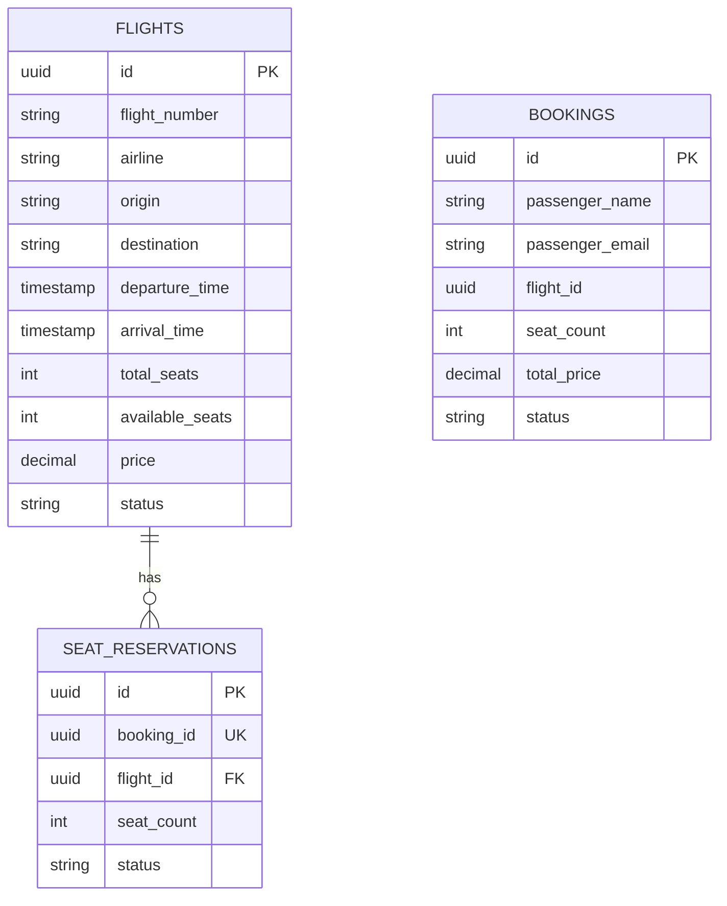

# HW3 Flight Booking

Сделал вариант на Go: `booking-service` отдаёт REST, `flight-service` поднимает gRPC и кэширует чтения в Redis.

Что есть:

- `SearchFlights`, `GetFlight`, `ReserveSeats`, `ReleaseReservation` в `proto/flight.proto`
- две отдельные PostgreSQL
- миграции через Flyway
- аутентификация gRPC по API key через metadata
- Redis cache-aside для `GetFlight` и `SearchFlights`
- retry в `booking-service` для `UNAVAILABLE` и `DEADLINE_EXCEEDED`
- транзакции и `SELECT ... FOR UPDATE` при резервировании/освобождении мест

Запуск:

```bash
cd hw3
docker-compose up --build
```

Примеры:

```bash
curl -X POST localhost:8080/bookings \
  -H 'Content-Type: application/json' \
  -d '{"passenger_name":"Ivan Petrov","passenger_email":"ivan@example.com","flight_id":"<uuid>", "seat_count":2}'
```

ER-диаграмма:


